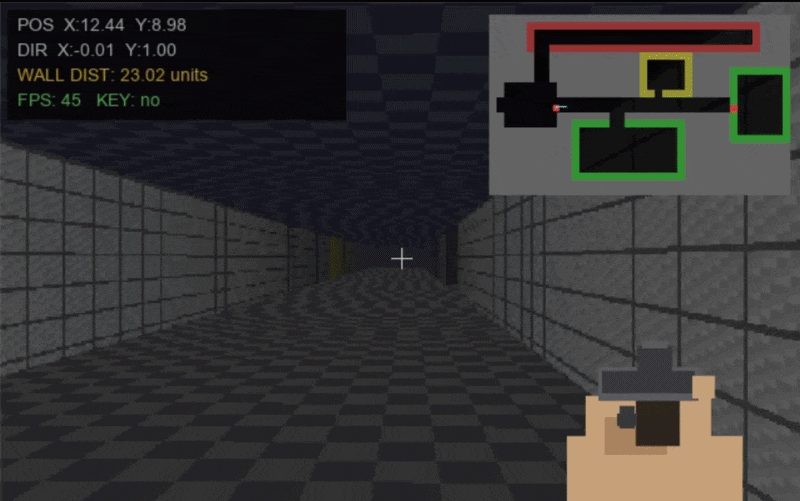
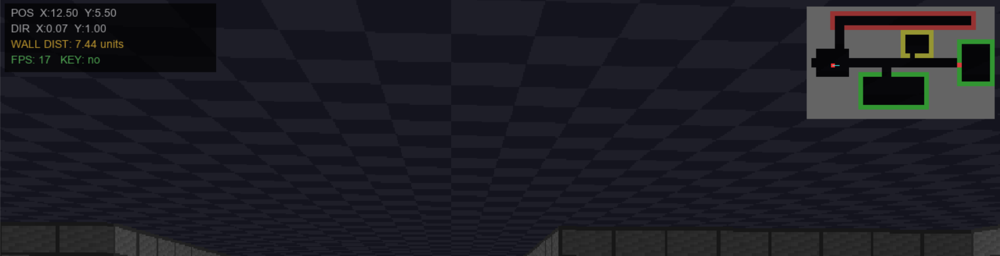
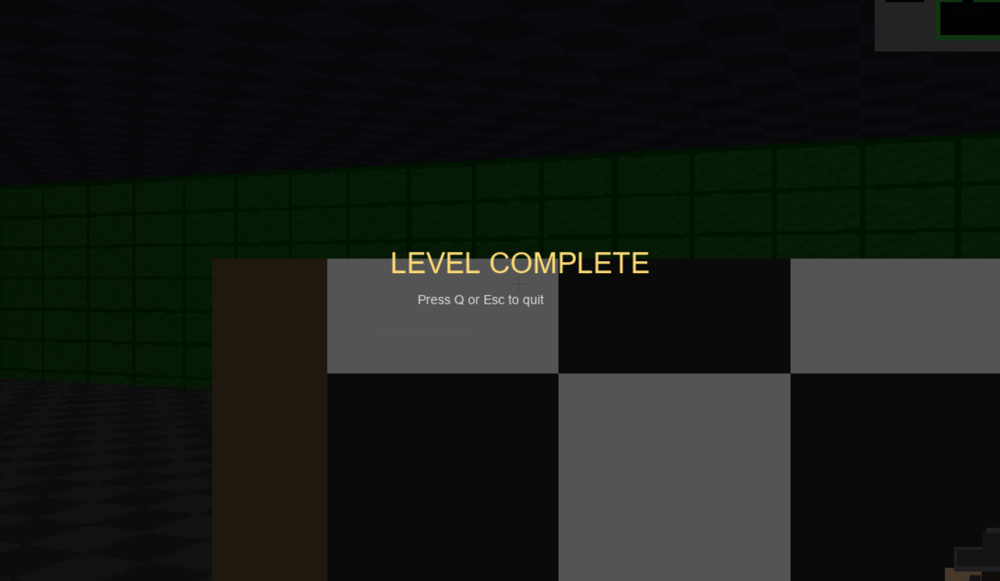

# Raycaster

A Wolfenstein-style 3D raycaster built from scratch in Python (NumPy +
tkinter) — no game engine, no OpenGL, and no `math.sin`/`math.cos` in the
hot path (see [Why a custom Taylor series](#why-a-custom-taylor-series)).
Fully vectorised: zero per-column Python loops anywhere in the render
path, from wall rasterisation through sprite compositing.



## Contents

- [Architecture](#architecture)
- [The showcase level](#the-showcase-level)
- [Why a custom Taylor series](#why-a-custom-taylor-series)
- [Benchmarks](#benchmarks)
- [Controls](#controls)
- [Running it](#running-it)
- [Tests](#tests)
- [Level data format](#level-data-format)

## Architecture

```
raycaster/
  math_utils.py   Custom Taylor-series sin/cos (scalar + vectorised) and
                   the 2D rotation matrix built from them.
  config.py        Every tunable constant in one place (resolution,
                   speeds, lighting falloff, fog, shoot/door timings).
  level.py         Loads a level JSON into runtime structures: the wall
                   grid, DoorState objects, sprite/pickup placement, spawn
                   pose. Also owns collision testing and the per-frame
                   "door-aware" hit-map used by the ray caster.
  textures.py      Procedural pixel-art generation (walls, floor/ceiling,
                   sprites, weapon, muzzle flash) + load-or-generate-and-
                   cache helpers.
  entities.py      Player (movement/collision/rotation), GameState (the
                   one mutable object gameplay functions take instead of
                   scattered globals), doors, pickups, win condition,
                   shooting.
  render.py        The renderer: floor/ceiling projection, vectorised DDA
                   wall casting, lighting/fog, and sprite billboarding —
                   all at the internal render resolution.
  hud.py           Everything drawn at full window resolution on top of
                   the upscaled scene: mini-map, debug panel, weapon with
                   recoil, muzzle flash, prompts, win screen.
  controls.py      Keyboard/mouse state and per-frame input application.
  main.py          tkinter window setup + the render loop. Wires every
                   other module together; owns no game logic itself.
  data/level*.json Level layout and entity placement — see below.
  assets_cache/    Procedurally generated textures/sprites, cached to
                   disk on first run. Not tracked in git — delete this
                   folder any time to force a clean regeneration.
tests/
  test_trig.py      Regression tests for the custom trig (see next section).
  test_gameplay.py  Headless tests for collision, doors, shooting, win
                    condition — no tkinter window required.
tools/
  benchmarks.py         Measures trig accuracy and FPS vs RENDER_SCALE.
                         Not graded/asserted — just prints what's true
                         right now, on whatever machine you run it on.
  verify_connectivity.py  Runs a BFS over the level grid with doors
                         closed vs open, to confirm the vault room is
                         actually gated and not accidentally reachable
                         some other way. See the showcase level section.
assets/
  demo.gif          Gameplay clip — movement, shooting, a door opening.
  hud.png           Close-up of the mini-map/debug panel/weapon HUD.
  wincon.png        The win screen.
Raycaster.ipynb    Notebook walkthrough of the engine internals — loads a
                   level, renders a frame headlessly and displays it
                   inline, and runs the trig/connectivity checks without
                   needing a tkinter window. Good for a quick look at
                   what the renderer actually produces without launching
                   the full game.
```

Data flow per frame: `controls.apply_input` mutates `Player` inside
`GameState` → `entities.update_*` advances doors/pickups/win/bob →
`render.render` + `render.draw_sprites` fill the internal-resolution
buffer → `main` upscales it (nearest-neighbour) into the full-resolution
frame → `hud.draw_hud` composites UI on top → one `PhotoImage.paste()`
call pushes it to the tkinter canvas.

## The showcase level

`data/level1.json` is laid out as a short guided tour rather than a maze,
so each engine feature gets its own space to be seen in isolation:

| Room | Showcases |
|---|---|
| Spawn Hall | Basic textured walls, starting orientation |
| Lighting & Fog Hall | A long straight corridor — distance-based brightness falloff and fog blending are visible over its full length |
| Sprite Gallery | Persons + barrels, all shootable |
| Key Alcove | The key pickup, off the main path |
| Vault (behind the locked door) | The door mechanic end-to-end (find key → unlock → slide-open animation) gating the exit flag / win screen |

Connectivity was checked with a BFS over the level grid (`tools/verify_connectivity.py`):
with every door treated as closed, 261 cells are reachable from spawn;
with every door treated as open, 310 are reachable. The 49-cell
difference is exactly the vault — confirming it's genuinely gated behind
the door and not reachable some other way through the grid.

The door slides upward when opened — animated by shrinking the drawn
vertical range as `open_amount` increases, in `render.render`. Worth
noting this doesn't currently match the texture's ribbing, which runs
vertically (as if the door were meant to slide sideways); that's a known
cosmetic mismatch, not a bug in the collision/gameplay logic, and it's
on the list to either flip the ribbing back or switch the animation to a
sideways slide properly, but it hasn't been decided yet.

## Why a custom Taylor series

`math_utils.py` reimplements `sin`/`cos` from their Taylor series instead
of calling `math.sin`/`np.sin`. This isn't a performance choice — `libm`'s
sin/cos will always be at least as fast (see benchmarks below) — it's a
correctness-ownership choice. Two real bugs shipped in earlier versions of
this code specifically *because* the trig was hand-rolled:

1. **`mc_cos`** originally contained a Newton-Raphson square-root
   iteration copy-pasted from somewhere else in the file — not a cosine
   approximation at all. It ran without raising and returned
   plausible-looking floats, which is exactly the kind of bug that
   survives casual testing and only shows up as "the camera rotation
   feels subtly wrong."
2. **`vec_sin`** had `t = X.copy` (missing the call parentheses, so `t`
   was bound to the *method object*, not an array) and a normalised
   array `X` that was computed but never actually used in the loop —
   the un-normalised `x` was read instead, so results only happened to
   be correct for inputs already inside `[-pi, pi]`.

Both are now permanently guarded by `tests/test_trig.py`, which checks
`mc_sin`/`mc_cos`/`vec_sin`/`vec_cos` against `math`/`numpy` reference
values across a 2000-point sweep of `[-pi, pi]`, plus explicit regression
cases for each bug's exact failure mode (a scalar sqrt-iteration output
would fail `mc_cos(pi) == -1`; a method-object bug would fail
`isinstance(vec_sin(...), np.ndarray)`).

## Benchmarks

Run `PYTHONPATH=. python3 tools/benchmarks.py` yourself — numbers below
are a real run on my machine (AMD Ryzen 7 6800H, Python 3.11.15, NumPy
2.4.6, Windows), not projections. Expect different absolute numbers on
different hardware; the shape of the results (vectorised >> scalar, FPS
roughly linear in pixel count) should hold everywhere.

**Trig accuracy** (20,000-point sweep across `[-pi, pi]`, vs `math`/`numpy`):

| Function | Max abs error | Time (20k calls) | vs stdlib |
|---|---|---|---|
| `mc_sin` (scalar) | 5.289e-10 | 63.11 ms | 37.7x slower than `math.sin` |
| `mc_cos` (scalar) | 3.529e-9 | 62.97 ms | — |
| `vec_sin` (vectorised) | 5.289e-10 | 0.98 ms | 7.9x slower than `np.sin` |
| `vec_cos` (vectorised) | 3.529e-9 | 0.79 ms | — |

Cosine's error is consistently ~7x larger than sine's at the same term
count (9 terms) — its series is purely even-power, so convergence is
marginally slower near the interval edges. Both are still five to nine
orders of magnitude below anything that would be visible at pixel
resolution. The vectorised forms are the ones actually used in the
rotation hot path; the slowdown vs stdlib is the deliberate trade for
owning (and testing) the numerics rather than trusting an opaque libm
call.

**FPS vs `RENDER_SCALE`** (render + sprite pass only, headless, 150
frames per scale — this measures the pipeline in isolation, not the
tkinter display blit, so in-window FPS will be somewhat lower):

| RENDER_SCALE | Internal resolution | ms/frame | FPS |
|---|---|---|---|
| 1.00 | 640x408 | 24.95 | 40.1 |
| 0.75 | 480x306 | 13.95 | 71.7 |
| 0.62 (default) | 396x252 | 10.28 | 97.3 |
| 0.50 | 320x204 | 7.03 | 142.3 |
| 0.35 | 224x142 | 3.68 | 271.7 |

The relationship is close to linear in pixel count (`RENDER_W *
RENDER_H`), which is expected since the dominant cost is the full-frame
wall-colour gather in `render.py` — it does the same amount of work per
pixel regardless of scale. `RENDER_SCALE = 0.62` was chosen as the
default because it's roughly the point where visual softening from the
nearest-neighbour upscale becomes noticeable before pushing further; the
chunky-pixel look at lower scales is also period-appropriate for the
genre, so this is as much an aesthetic choice as a performance one. This
run was on a laptop chip (Ryzen 7 6800H), so a desktop part will likely
post higher numbers across the board.



## Controls

| Key | Action |
|---|---|
| `W` / `↑` | Move forward |
| `S` / `↓` | Move backward |
| `A` / `D` | Strafe left / right |
| `←` / `→` | Turn left / right |
| Mouse | Look (click the window to capture it) |
| Click (while captured) | Shoot |
| `E` | Open/close a door you're facing, or unlock one with a key |
| `Q` / `Esc` | Quit |

## Running it

```bash
pip install -r requirements.txt
python3 -m raycaster
```

Textures/sprites are procedurally generated on first run and cached to
`raycaster/assets_cache/`.

To try the second (much smaller) level stub, demonstrating that level
layout is pure data, not code:

```python
from raycaster.main import run_engine
run_engine('raycaster/data/level2.json')
```



## Tests

```bash
pip install pytest
PYTHONPATH=. python3 -m pytest tests/ -v
```

32 tests, all headless (no tkinter window is created — `Player`/`Level`/
`render` all operate on plain NumPy buffers). Verified passing 32/32 on
Python 3.11.15, NumPy 2.4.6, pytest 9.1.1. Covers: trig accuracy and
both documented bug regressions, level loading, the full render pipeline,
strafe direction (verified against the actual on-screen projection math,
not just self-consistency), collision, door lock/unlock/toggle, shooting
(both barrels and persons — an earlier version only allowed barrels), and
the win condition.

## Level data format

Map layout, wall colours, door placement, sprites, key pickups, and the
exit are all in `data/level*.json` — none of it is hardcoded in Python.
To build a new level: write a new JSON file in the same shape (see
`level.py::Level.__init__` for the exact schema) and pass its path to
`run_engine(level_path=...)`. Grid cell values: `0` = floor, `1`/`2`/`3`/`5`
= wall variants (see `wall_colors`), `4` = door (listed explicitly in
`doors` for lock state, or left unlocked by default if just placed in the
grid).
